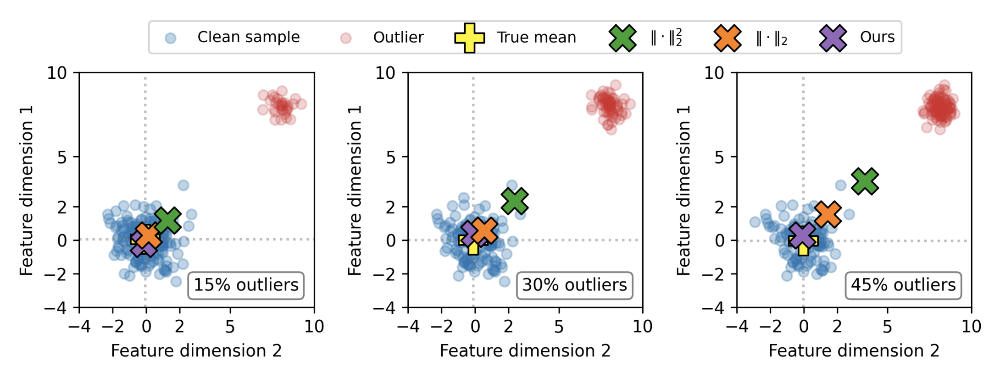
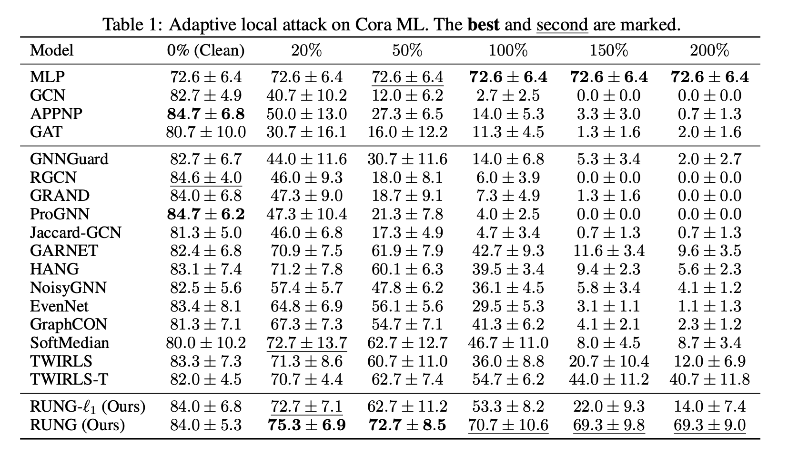

# RUNG: Graph Neural Networks via Unbiased Aggregation


This repository provides the code, data, and results for the paper: Graph Neural Networks via Unbiased Aggregation [[arXiv](https://arxiv.org/abs/2311.14934v2)].

<p float="left">
  
  <!--   -->
</p>


## Requirements

This project is built upon [Python 3.10](https://www.python.org).
For a complete list of required packages, please find them in the `requirements.txt` file.
It is recommended to create a new `conda` environment for this project as it may be tricky to install PyQt as it can mess up your current dependencies.

```bash
conda create -n rung python=3.10
conda activate rung

pip install -r requirements.txt
```


## Reproducing Results

### Train the model
```bash
python clean.py --model='RUNG' --norm='MCP' --gamma=6.0 --data='cora'
```

### PGD attack on the trained model
```bash
python attack.py --model='RUNG' --norm='MCP' --gamma=6.0 --data='cora'
```


## Experimental Results


<p float="left">
  
  <!--   -->
</p>

## Citation

If you find our work helpful, please consider citing it as
```
@misc{hou2024robustgraphneuralnetworks,
      title={Robust Graph Neural Networks via Unbiased Aggregation}, 
      author={Zhichao Hou and Ruiqi Feng and Tyler Derr and Xiaorui Liu},
      year={2024},
      eprint={2311.14934},
      archivePrefix={arXiv},
      primaryClass={cs.LG},
      url={https://arxiv.org/abs/2311.14934}, 
}
```
