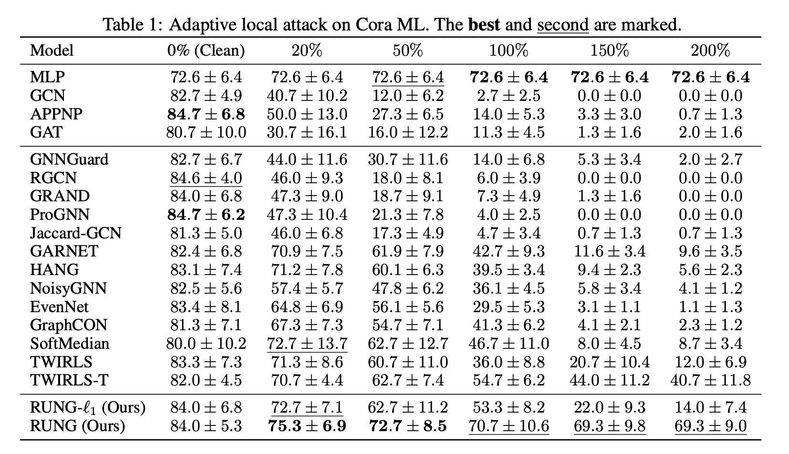

# RUNG: Robust Graph Neural Networks via Unbiased Aggregation

This repository provides the official implementation for the paper:

> **Robust Graph Neural Networks via Unbiased Aggregation**
> Zhichao Hou, Ruiqi Feng, Tyler Derr, Xiaorui Liu
> [[arXiv]](https://arxiv.org/abs/2311.14934v2)

<p float="left">
  
</p>

---

## Overview

RUNG proposes a principled framework for robust graph neural networks by replacing the standard aggregation with an unbiased variant that is provably resistant to adversarial structural perturbations. The method supports multiple robust norm penalties (MCP, L1, L2) controlled via the `--norm` and `--gamma` hyperparameters.

---

## Installation

We recommend creating a dedicated conda environment:

```bash
conda create -n rung python=3.10
conda activate rung
pip install -r requirements.txt
```

**Dependencies** are listed in `requirements.txt` and include PyTorch 2.6 (CUDA 12.4), PyTorch Geometric, and standard scientific Python libraries.

> **Note:** `torchtyping` requires a one-time patch after installation due to a known incompatibility with PyTorch ≥ 2.0. This is handled automatically — see `requirements.txt` for details.

---

## Usage

### Training on Clean Graphs

```bash
python clean.py --model=RUNG --norm=MCP --gamma=36 --data=cora
```

| Argument | Default | Description |
|---|---|---|
| `--model` | `RUNG` | Model architecture (`RUNG`, `GCN`, `GAT`) |
| `--norm` | `MCP` | Robust penalty type (`MCP`, `L1`, `L2`) |
| `--gamma` | `36.0` | Penalty hyperparameter |
| `--data` | `cora` | Dataset (`cora`, `citeseer`) |
| `--lr` | `0.05` | Learning rate |
| `--weight_decay` | `5e-4` | Weight decay |
| `--max_epoch` | `300` | Number of training epochs |

Logs are saved to `log/{data}/clean/{data}_{model}_{norm}_g{gamma}_{timestamp}.log`.

### Robustness Evaluation (PGD Attack)

```bash
python attack.py --model=RUNG --norm=MCP --gamma=36 --data=cora
```

---

## Results

<p float="left">
  
</p>

---

## Citation

If you find this work useful, please cite:

```bibtex
@misc{hou2024robustgraphneuralnetworks,
  title   = {Robust Graph Neural Networks via Unbiased Aggregation},
  author  = {Zhichao Hou and Ruiqi Feng and Tyler Derr and Xiaorui Liu},
  year    = {2024},
  eprint  = {2311.14934},
  archivePrefix = {arXiv},
  primaryClass  = {cs.LG},
  url     = {https://arxiv.org/abs/2311.14934}
}
```
