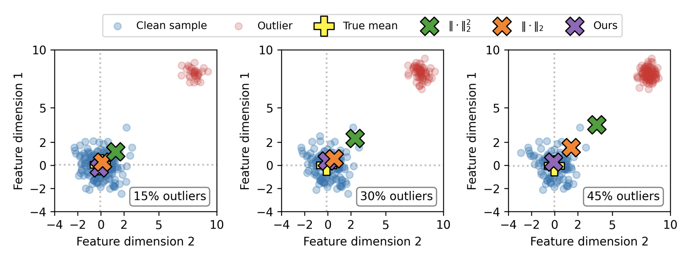
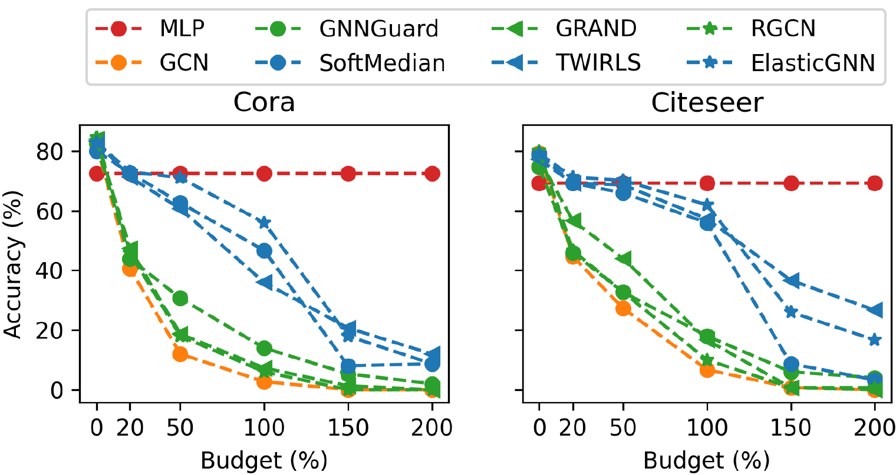
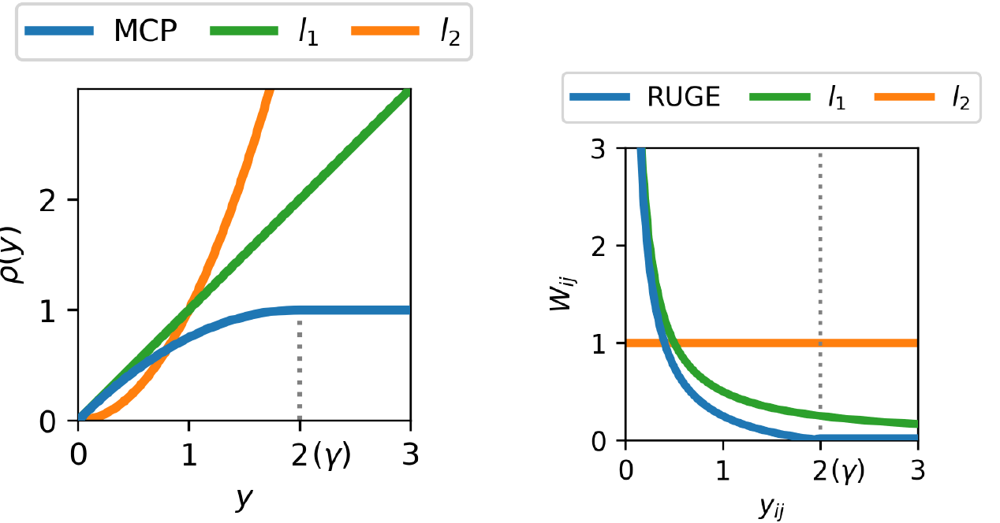
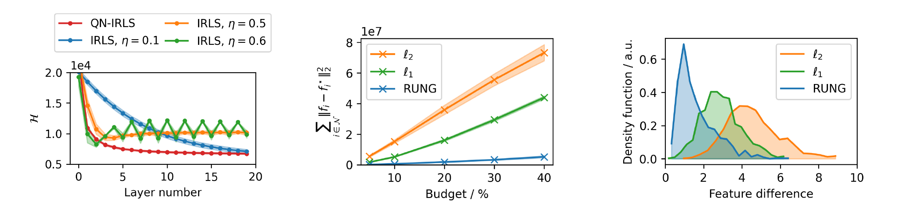

<div align="center">

# RUNG: Robust Graph Neural Networks via Unbiased Aggregation

**[Zhichao Hou](mailto:zhou4@ncsu.edu)<sup>1,\*</sup> · Ruiqi Feng<sup>1,\*</sup> · Tyler Derr<sup>2</sup> · [Xiaorui Liu](mailto:xliu96@ncsu.edu)<sup>1,†</sup>**

<sup>1</sup>North Carolina State University &nbsp;&nbsp; <sup>2</sup>Vanderbilt University
<br><sup>\*</sup>Equal contribution &nbsp;&nbsp; <sup>†</sup>Corresponding author

**NeurIPS 2024**

[](https://arxiv.org/abs/2311.14934)
[](https://arxiv.org/abs/2311.14934)
[](https://www.python.org/)
[](https://pytorch.org/)

[**📄 Paper**](https://arxiv.org/abs/2311.14934) · [**🚀 Quick Start**](#-quick-start) · [**📊 Results**](#-results) · [**📝 Citation**](#-citation)

</div>

---

> **TL;DR.** Many robust GNNs (SoftMedian, TWIRLS, ElasticGNN) are secretly the same thing: **ℓ<sub>1</sub>-based robust graph smoothing**. That explains why they are more robust than GCN, and also why they **collapse under large attack budgets**: ℓ<sub>1</sub> estimation is *biased*, and every adversarial edge adds to the bias. **RUNG** replaces ℓ<sub>1</sub> with an unbiased MCP penalty and solves it with a stepsize-free **Quasi-Newton IRLS**. The solver unrolls into an interpretable aggregation layer that **prunes suspicious edges** and stays robust even when the attacker perturbs 200% of a node's edges.

<p align="center">
  
  <br>
  <em>Mean estimation with outliers. As the outlier ratio grows, the ℓ<sub>2</sub> estimator (green) and the ℓ<sub>1</sub> estimator (orange) drift away from the true mean. Our estimator (purple) stays close to it.</em>
</p>

## ✨ Highlights

- 🔍 **A unified view of robust GNNs.** SoftMedian, TWIRLS and ElasticGNN all approximately solve the same ℓ<sub>1</sub>-based graph signal smoothing problem. This explains why their robustness is so closely aligned.
- ⚠️ **Estimation bias explains the collapse.** ℓ<sub>1</sub> shrinks edge differences toward zero, so adversarial edges add up to a bias that grows with the attack budget.
- 🛡️ **RUGE: a robust *and unbiased* estimator.** RUGE replaces ℓ<sub>1</sub> with the Minimax Concave Penalty (MCP). Small differences are smoothed as in ℓ<sub>1</sub>, and edges with large differences get zero weight.
- ⚡ **QN-IRLS with a convergence guarantee.** A diagonal Quasi-Newton approximation of the Hessian gives a solver that needs no stepsize tuning and provably decreases the objective (Thm. 2).
- 🧩 **Plug-and-play GNN layer.** The unrolled solver *is* the RUNG layer. It covers **APPNP**, **GCN** and **ℓ<sub>1</sub> GNNs** as special cases, with complexity $O(k(m+n)d)$, the same as GCN.

## 🔬 Motivation: why do robust GNNs still fail?

<p align="center">
  
  <br>
  <em>Adaptive local attacks. The ℓ<sub>1</sub>-based defenses (blue) are clearly the most robust, but they still fall below the graph-agnostic MLP as the budget grows.</em>
</p>

## 🧠 Method

### Robust and Unbiased Graph signal Estimator (RUGE)

$$
\min_{\mathbf{F}}\ \mathcal{H}(\mathbf{F}) = \sum_{(i,j)\in\mathcal{E}} \rho_\gamma\left(\left\lVert \frac{\mathbf{f}_i}{\sqrt{d_i}} - \frac{\mathbf{f}_j}{\sqrt{d_j}} \right\rVert_2\right) + \lambda \sum_{i\in\mathcal{V}} \lVert \mathbf{f}_i - \mathbf{f}_i^{(0)} \rVert_2^2,
\qquad
\rho_\gamma(y) = \begin{cases} y - \frac{y^2}{2\gamma}, & y < \gamma \\ \frac{\gamma}{2}, & y \ge \gamma \end{cases}
$$

### RUNG layer (unrolled QN-IRLS)

$$
\mathbf{F}^{(k+1)} = \left(\mathrm{diag}(\mathbf{q}^{(k)}) + \lambda \mathbf{I}\right)^{-1}\left( (\mathbf{W}^{(k)} \odot \tilde{\mathbf{A}})\, \mathbf{F}^{(k)} + \lambda \mathbf{F}^{(0)} \right),
\qquad
W^{(k)}_{ij} = \mathbb{1}_{i\neq j}\max\left(0, \frac{1}{2 y^{(k)}_{ij}} - \frac{1}{2\gamma}\right)
$$

where $y^{(k)}_{ij} = \lVert \mathbf{f}^{(k)}_i/\sqrt{d_i} - \mathbf{f}^{(k)}_j/\sqrt{d_j} \rVert_2$ and $q^{(k)}_m = \sum_j W^{(k)}_{mj} A_{mj} / d_m$.

<table>
<tr>
<td width="48%"></td>
<td>

**How to read it.** RUNG is a *reweighted* graph aggregation. The edge weight $W_{ij}$ is large for similar neighbors and becomes **exactly zero** once $y_{ij} \ge \gamma$, so edges that are likely adversarial get pruned. Different choices of $\rho$ recover known models:

| $\rho(y)$ | $\lambda$ | Recovers |
|:--|:--:|:--|
| $y^2$ | $>0$ | APPNP |
| $y^2$ | $0$ | GCN |
| $y$ | $>0$ | ℓ<sub>1</sub> GNN (≈ ElasticGNN / TWIRLS / SoftMedian) |
| $\rho_\gamma$ (MCP) | $>0$ | **RUNG** |

</td>
</tr>
</table>

## 📊 Results

**Adaptive** PGD attacks target the victim model directly instead of a surrogate. Below is node classification accuracy (%) on **Cora ML**, averaged over 5 splits. See the paper for all 15+ baselines, Citeseer, Ogbn-Arxiv, transfer, poisoning and injection attacks.

<details open>
<summary><b>Adaptive local attack (budget = % of target node's degree)</b></summary>

| Model | Clean | 20% | 50% | 100% | 150% | 200% |
|:--|:--:|:--:|:--:|:--:|:--:|:--:|
| MLP | 72.6 ± 6.4 | 72.6 ± 6.4 | 72.6 ± 6.4 | **72.6 ± 6.4** | **72.6 ± 6.4** | **72.6 ± 6.4** |
| GCN | 82.7 ± 4.9 | 40.7 ± 10.2 | 12.0 ± 6.2 | 2.7 ± 2.5 | 0.0 ± 0.0 | 0.0 ± 0.0 |
| APPNP | **84.7 ± 6.8** | 50.0 ± 13.0 | 27.3 ± 6.5 | 14.0 ± 5.3 | 3.3 ± 3.0 | 0.7 ± 1.3 |
| GNNGuard | 82.7 ± 6.7 | 44.0 ± 11.6 | 30.7 ± 11.6 | 14.0 ± 6.8 | 5.3 ± 3.4 | 2.0 ± 2.7 |
| ProGNN | **84.7 ± 6.2** | 47.3 ± 10.4 | 21.3 ± 7.8 | 4.0 ± 2.5 | 0.0 ± 0.0 | 0.0 ± 0.0 |
| SoftMedian | 80.0 ± 10.2 | 72.7 ± 13.7 | 62.7 ± 12.7 | 46.7 ± 11.0 | 8.0 ± 4.5 | 8.7 ± 3.4 |
| TWIRLS | 83.3 ± 7.3 | 71.3 ± 8.6 | 60.7 ± 11.0 | 36.0 ± 8.8 | 20.7 ± 10.4 | 12.0 ± 6.9 |
| TWIRLS-T | 82.0 ± 4.5 | 70.7 ± 4.4 | 62.7 ± 7.4 | 54.7 ± 6.2 | 44.0 ± 11.2 | 40.7 ± 11.8 |
| RUNG-ℓ<sub>1</sub> (ours) | 84.0 ± 6.8 | 72.7 ± 7.1 | 62.7 ± 11.2 | 53.3 ± 8.2 | 22.0 ± 9.3 | 14.0 ± 7.4 |
| **RUNG (ours)** | 84.0 ± 5.3 | **75.3 ± 6.9** | **72.7 ± 8.5** | 70.7 ± 10.6 | 69.3 ± 9.8 | 69.3 ± 9.0 |

</details>

<details open>
<summary><b>Adaptive global attack (budget = % of all edges)</b></summary>

| Model | Clean | 5% | 10% | 20% | 30% | 40% |
|:--|:--:|:--:|:--:|:--:|:--:|:--:|
| MLP | 65.0 ± 1.0 | 65.0 ± 1.0 | 65.0 ± 1.0 | 65.0 ± 1.0 | 65.0 ± 1.0 | 65.0 ± 1.0 |
| GCN | 85.0 ± 0.4 | 75.3 ± 0.5 | 69.6 ± 0.5 | 60.9 ± 0.7 | 54.2 ± 0.6 | 48.4 ± 0.5 |
| APPNP | **86.3 ± 0.4** | 75.8 ± 0.5 | 69.7 ± 0.7 | 60.3 ± 0.9 | 53.8 ± 1.2 | 49.0 ± 1.6 |
| GNNGuard | 83.1 ± 0.7 | 74.6 ± 0.7 | 70.2 ± 1.0 | 63.1 ± 1.1 | 57.5 ± 1.6 | 51.0 ± 1.2 |
| SoftMedian | 85.0 ± 0.7 | 78.6 ± 0.3 | 75.5 ± 0.9 | 69.5 ± 0.5 | 62.8 ± 0.8 | 58.1 ± 0.7 |
| TWIRLS | 84.2 ± 0.6 | 77.3 ± 0.8 | 72.9 ± 0.3 | 66.9 ± 0.2 | 62.4 ± 0.6 | 58.7 ± 1.1 |
| TWIRLS-T | 82.8 ± 0.5 | 76.8 ± 0.6 | 73.2 ± 0.4 | 67.7 ± 0.4 | 63.8 ± 0.2 | 60.8 ± 0.3 |
| RUNG-ℓ<sub>1</sub> (ours) | 85.8 ± 0.5 | 78.4 ± 0.4 | 74.3 ± 0.3 | 68.1 ± 0.6 | 63.5 ± 0.7 | 59.8 ± 0.8 |
| **RUNG (ours)** | 84.6 ± 0.5 | **78.9 ± 0.4** | **75.7 ± 0.2** | **71.8 ± 0.4** | **67.8 ± 1.3** | **65.1 ± 1.2** |

</details>

<details>
<summary><b>Large scale: global PGD (PRBCD) on Ogbn-Arxiv</b></summary>

| Model | Clean | 1% | 5% | 10% |
|:--|:--:|:--:|:--:|:--:|
| GCN | 71.9 ± 0.5 | 63.1 ± 0.4 | 48.9 ± 3.2 | 41.8 ± 0.5 |
| APPNP | 71.7 ± 0.3 | 64.2 ± 0.4 | 50.1 ± 2.3 | 42.2 ± 1.3 |
| SoftMedian | 71.2 ± 0.5 | 65.1 ± 0.3 | 54.1 ± 1.6 | 50.1 ± 2.6 |
| RUNG-ℓ<sub>1</sub> (ours) | 71.6 ± 0.6 | 65.5 ± 0.4 | 55.0 ± 1.1 | 49.6 ± 1.1 |
| **RUNG (ours)** | 70.2 ± 2.1 | 65.2 ± 0.2 | **64.0 ± 0.8** | **61.2 ± 0.7** |

</details>

### Ablations

<p align="center">
  
  <br>
  <em><b>Left:</b> QN-IRLS converges quickly and monotonically, while first-order IRLS is either slow or oscillates. <b>Middle:</b> the estimation bias of ℓ<sub>2</sub> and ℓ<sub>1</sub> grows with the attack budget, while RUNG stays almost unbiased. <b>Right:</b> RUNG forces the attacker to use edges with small feature differences, which have little effect.</em>
</p>

## 🗂️ Repository Structure

```
RUNG/
├── model/
│   ├── rung.py              # ⭐ RUNG model: MLP encoder + QN-IRLS aggregation layers (Eq. 8)
│   ├── att_func.py          # edge reweighting W = dρ(y)/dy² for MCP / ℓ1 / ℓ2 / SCAD / ...
│   ├── mlp.py               # MLP encoder
│   └── gcn.py, gat.py, softmedian.py   # baselines
├── gb/                      # graph-attack toolbox (PGD, Nettack, baselines), adapted from Mujkanovic et al.
├── exp/
│   ├── config/get_model.py  # model factory: RUNG, RUNG-ℓ1 (L1), APPNP, GCN, GAT, MLP
│   └── result_io.py         # saving/loading checkpoints, accuracies and edge flips
├── train_eval_data/         # dataset loading, fixed 10/10/80 splits, training loop
├── data/                    # Cora ML & Citeseer (.npz)
├── scripts/                 # run.sh, patch_torchtyping.py
├── clean.py                 # ① train on the clean graph and save checkpoints
└── attack.py                # ② adaptive global PGD evasion attack on the saved checkpoints
```

## ⚙️ Installation

```bash
conda create -n rung python=3.10 -y
conda activate rung
pip install -r requirements.txt

# torchtyping 0.1.4 does not import under PyTorch >= 2.0; apply a one-line fix:
python scripts/patch_torchtyping.py
```

## 🚀 Quick Start

### 1. Train on the clean graph

```bash
python clean.py --model RUNG --norm MCP --gamma 36 --data cora
```

This trains on the 5 fixed splits and reports test accuracy. Checkpoints go to `exp/models/{data}/{model}_{norm}_{gamma}/` and logs to `log/{data}/clean/`.

### 2. Attack the trained models (adaptive global PGD)

```bash
python attack.py --model RUNG --norm MCP --gamma 36 --data cora
```

This loads the checkpoints from step 1 and attacks each one with budgets of 5%, 10%, 20%, 30% and 40% of the edges. Accuracies go to `exp/result/{data}/` and logs to `log/{data}/attack/`.

Or run both steps at once: `bash scripts/run.sh cora 36 MCP`.

### Arguments

| Argument | Default | Description |
|:--|:--:|:--|
| `--model` | `RUNG` | `RUNG`, `L1` (RUNG-ℓ<sub>1</sub>), `APPNP`, `GCN`, `GAT`, `MLP` |
| `--norm` | `MCP` | penalty ρ: `MCP`, `L1`, `L2` (set automatically for `L1` / `APPNP`) |
| `--gamma` | `36.0` | MCP threshold γ. Smaller values prune more edges: more robust, slightly lower clean accuracy |
| `--data` | `cora` | `cora`, `citeseer` |
| `--lr` | `0.05` | learning rate (`clean.py`) |
| `--weight_decay` | `5e-4` | weight decay (`clean.py`) |
| `--max_epoch` | `300` | training epochs (`clean.py`) |

Architecture defaults (`exp/config/get_model.py`): a 2-layer MLP with 64 hidden units, followed by **10** RUNG layers with $\hat\lambda = 1/(1+\lambda) = 0.9$.

### Use RUNG in your own code

```python
import torch
from model.rung import RUNG
from model.att_func import get_mcp_att_func

model = RUNG(
    in_dim=X.shape[1], out_dim=num_classes, hidden_dims=[64],
    w_func=get_mcp_att_func(gamma=36.0),   # W = dρ_γ(y)/dy²
    lam_hat=0.9,                           # λ̂ = 1/(1+λ)
    prop_step=10,                          # number of RUNG layers
)
logits = model(A, X)                       # A: dense adjacency (n×n), X: features (n×d)
```

## 📝 Citation

If you find this work useful, please cite:

```bibtex
@inproceedings{hou2024robust,
  title     = {Robust Graph Neural Networks via Unbiased Aggregation},
  author    = {Hou, Zhichao and Feng, Ruiqi and Derr, Tyler and Liu, Xiaorui},
  booktitle = {Advances in Neural Information Processing Systems (NeurIPS)},
  year      = {2024}
}
```

## 🙏 Acknowledgements

The attack framework in `gb/` and the evaluation protocol are adapted from
[*Are Defenses for Graph Neural Networks Robust?*](https://github.com/LoadingByte/are-gnn-defenses-robust)
(Mujkanovic et al., NeurIPS 2022). We thank the authors for releasing their code.

## 📬 Contact

For questions, please open an issue or contact Zhichao Hou (`zhou4@ncsu.edu`).
